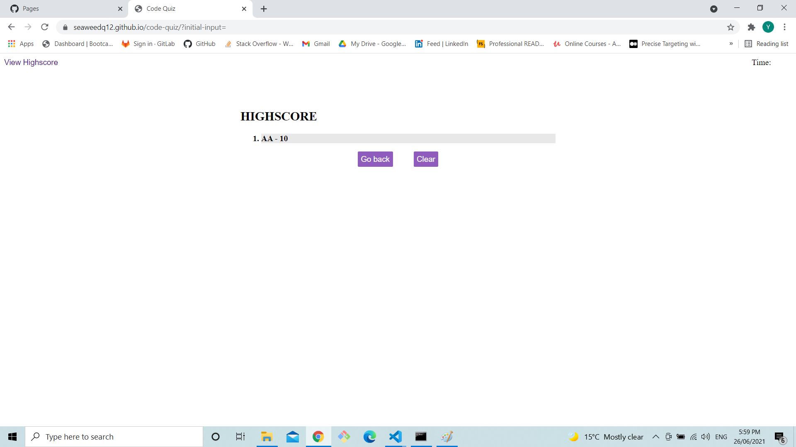
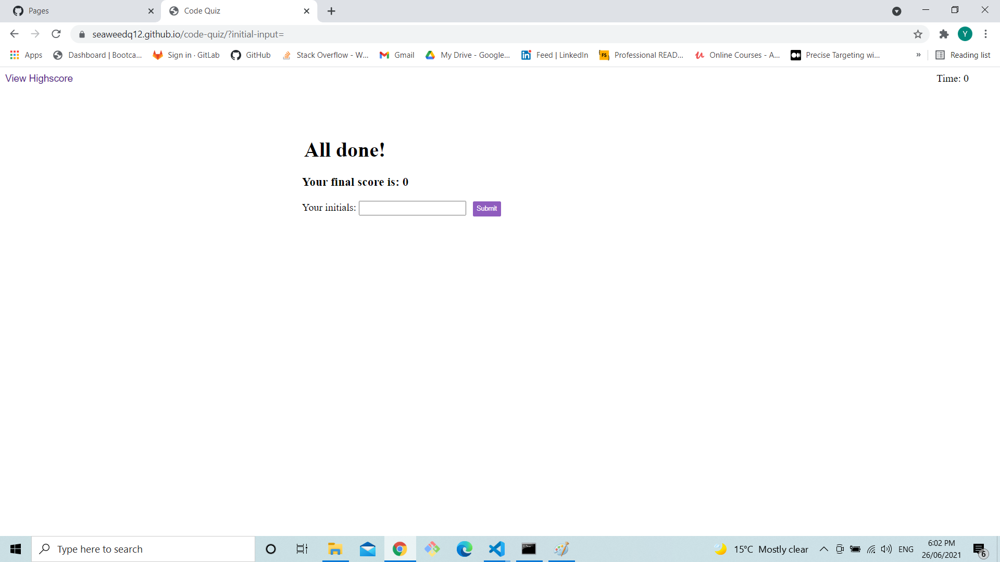

# 04 Web APIs: Code Quiz

## Task

In this weeks homework a quiz had to made.in the quiz a time limit is given to user to answer questions, when a question is answered correctly the user is given points and when answer incorrectly the time limit is reduced 

## URL

https://seaweedq12.github.io/code-quiz/

## Work

1. when the page is loaded a screen with a start button and view highscore is shown.

the user can either start the quiz or view the highscore saved in the local file.
2. when the view highscore is pressed a different **section** is rendered.

in this page there are two button **go back** and **clear**. go back refreshes the page with the quiz and the clear button clears scores that the user selects, if nothing is selected nothing will be cleared. highscores a updated when the user submits their score. Also the highscore button is disabled throught the quiz and enabled when finished.  

4. when the user starts the quiz, the user is given few choices which the user can select as answer.

5. finally when the quiz is finished or the time runs out a submit form pops up and the user can enter their initials. An empty initial will not be stored

 